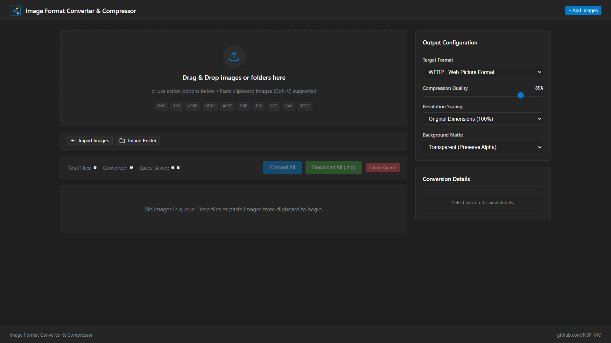
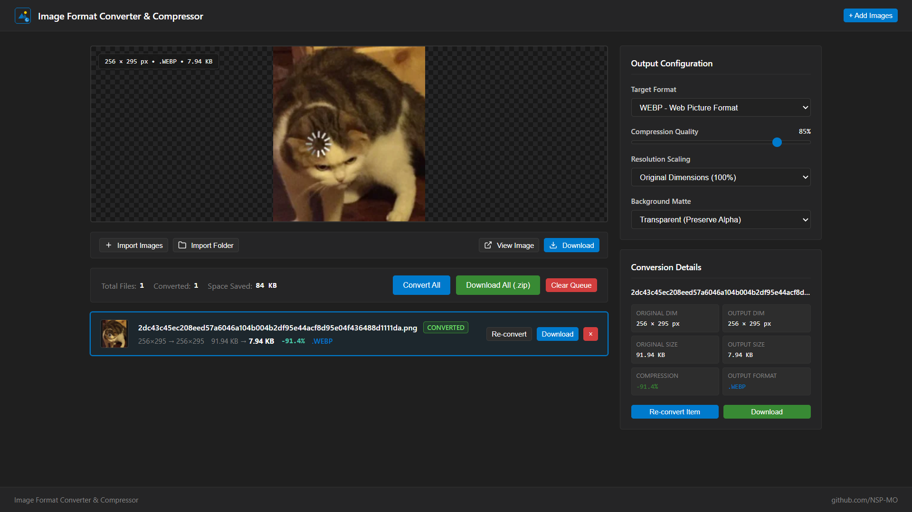

# Image Format Converter & Compressor - Chromium Browser Extension

A browser-native image format converter and compressor for Chromium browsers. The extension operates entirely within the client environment using standard Web APIs and WebAssembly, processing all media locally without external network dependencies.

---

## Interface Preview

### Start Page


### Conversion Page


---

## Architectural Overview

Image Format Converter & Compressor launches a dedicated, full-featured workspace tab upon clicking the extension icon in the Chromium toolbar. All image decoding, canvas manipulation, format transcoding, resizing, live preview rendering, and ZIP packaging run client-side in the browser engine.

### Key Capabilities

- **Offline Processing**: All decoding, transformation, and encoding take place locally in the browser memory. No network requests are initiated during conversion.
- **Comprehensive Format Support**:
  - **Input Formats**: HEIC, HEIF, PNG, JPG/JPEG, WEBP, AVIF, BMP, ICO, GIF, SVG, TIFF.
  - **Output Formats**: WEBP, PNG, JPEG, AVIF, BMP, ICO, GIF, SVG.
- **WebAssembly HEIC Decoder**: Bundled `libheif.js` WebAssembly engine with CSP-compliant Embind bindings for decoding high-efficiency image container files directly in memory.
- **Directory & Batch Import**:
  - Drag-and-drop support for individual files or entire directory trees with recursive asynchronous traversal.
  - Dedicated "Import Images" and "Import Folder" actions for batch loading.
  - Internal drag filtering to prevent accidental re-import of extension UI elements.
- **Live Preview Surface & Actions**:
  - Interactive preview surface displaying high-resolution views for both pending and converted media items.
  - Seamless navigation across the queue with immediate dimension and size extraction.
  - Direct full-resolution viewing in a new browser tab using standard Blob URLs.
- **Fine-Grained Output Controls**:
  - Variable compression quality slider (10% to 100%).
  - Resolution scaling modes (Original dimensions, percentage scaling, or custom pixel dimensions with aspect ratio preservation).
  - Background matte selection (Transparent alpha preservation, solid white, solid black, or dark surface fill).
- **Batch Processing & Archiving**:
  - Queue controller supporting batch conversion (`Convert All`) and granular single-item re-conversion.
  - Integrated ZIP archiver (`JSZip`) to bundle all converted assets into a single `.zip` file download.
- **Clipboard Integration**: Paste images directly from the system clipboard (`Ctrl+V`) into the conversion queue.

---

## Directory Structure

```text
├── manifest.json         # Extension metadata and configuration
├── background.js        # Service worker for workspace tab orchestration
├── app.html             # Standalone converter workbench application
├── assets/
│   ├── image1-startpage.png     # Initial workspace screenshot
│   └── image2-convertimage.png  # Live conversion preview screenshot
├── css/
│   └── app.css          # Dark Modern design system (#1f1f1f theme)
├── js/
│   ├── app.js           # Queue controller and UI interaction logic
│   ├── converter.js     # Canvas & binary format encoder engine
│   └── vendor/
│       ├── jszip.min.js   # Bundled offline ZIP archive generator
│       └── libheif.js     # Bundled offline HEIC/HEIF WebAssembly decoder
└── icons/
    ├── icon.svg         # Master scalable vector graphic
    ├── icon16.png       # Toolbar small icon
    ├── icon32.png       # Standard favicon
    ├── icon48.png       # Extension management icon
    ├── icon128.png      # High-DPI extension icon
    └── icon256.png      # High-definition store asset
```

---

## Installation Instructions

The extension can be installed on any Chromium-based browser, including Google Chrome, Microsoft Edge, Brave, Opera, and Vivaldi.

### Step-by-Step Installation

1. Open your Chromium browser.
2. Navigate to the Extensions Management page:
   - **Google Chrome**: `chrome://extensions`
   - **Microsoft Edge**: `edge://extensions`
   - **Brave Browser**: `brave://extensions`
3. Enable **Developer mode** using the toggle in the top-right corner.
4. Click the **Load unpacked** button.
5. Select the repository root folder containing `manifest.json`.
6. Pin the **Image Format Converter & Compressor** icon to your browser toolbar for direct access.
7. Click the toolbar icon to launch the converter workbench in a new tab.

---

## Technical Specifications

### Native Encoders & Binary Generators

- **PNG**: Alpha-preserving lossless canvas encoding (`image/png`).
- **JPEG**: Quantization-controlled lossy compression (`image/jpeg`) with matte fill compositing.
- **WEBP & AVIF**: High-efficiency next-generation compressed image export.
- **BMP**: Native binary generator creating 24-bit uncompressed Windows DIB headers with aligned row padding.
- **ICO**: Multi-resolution Windows Icon binary generator embedding high-fidelity PNG payloads compliant with Windows desktop and favicon standards.
- **SVG**: High-resolution raster wrapper preserving exact canvas coordinates and aspect ratio.

### Security and Content Security Policy (CSP)

- **Permissions**: The extension requests zero invasive permissions.
- **CSP Compliance**: Configured with `script-src 'self' 'wasm-unsafe-eval'; object-src 'self';` in Manifest V3 without string evaluations (`eval`, `new Function`) or inline event handlers.
- **Top-Level Navigation Safety**: All new-tab previews utilize standard `blob:` URLs generated via `URL.createObjectURL(blob)`, adhering strictly to Chromium top-frame navigation security policies.
